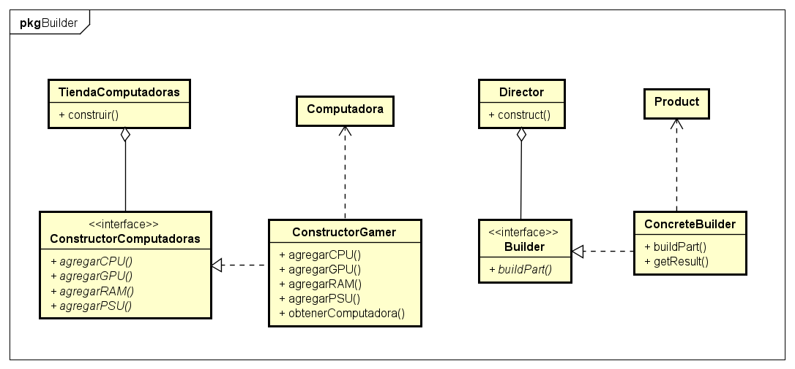
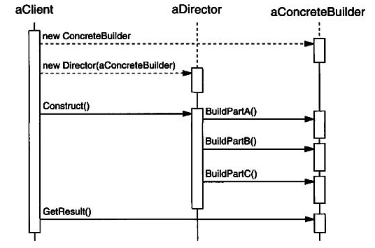

# Patrón Builder
  
## Tipo : Object Creational

## Intención
Separar la construcción de un objeto complejo de su representación,
así el mismo proceso de construcción puede crear diferentes representaciones.

## Cuando usar
* Cuando el algoritmo que se usa para crear un objeto complejo debe de ser independiente de las partes
que hacen al objeto y de como son ensambladas.

* Cuando el proceso de construcción debe de permitir diferentes representaciones para el objeto construido.

## Consecuencias
* Permite variar la representación interna de un producto. La interfaz del *Builder* hace que se
oculte la representación y la estructura interna del producto. También oculta como es armado.

* Aísla el código de construcción y el de representación, logrando mayor modularidad al encapsular el proceso de creación del objeto complejo.

* Proporciona un control mas detallado del proceso de construccion. Siendo que lo hace paso a paso.

## Diagramas
Se muestra un diagrama, a la izquierda esta el ejemplo realizado, y a la derecha el diagrama generico.

*No se incluyo el otro ConcreteBuilder en el diagrama del ejemplo*

* **Builder** Especifica la interfaz para crear las partes de un producto.

* **ConcreteBuilder** Construye y arma el producto. Implementa la interfaz

* **Director** Construye el objeto a traves de la interfaz de *Builder*.

* **Product** Es el objeto final creado.

Proceso de creación que se sigue generalmente.

## Fuentes
* Libro Design Patterns: Elements of Reusable Object-Oriented Software – Gamma, Erich [pags 120-131]

