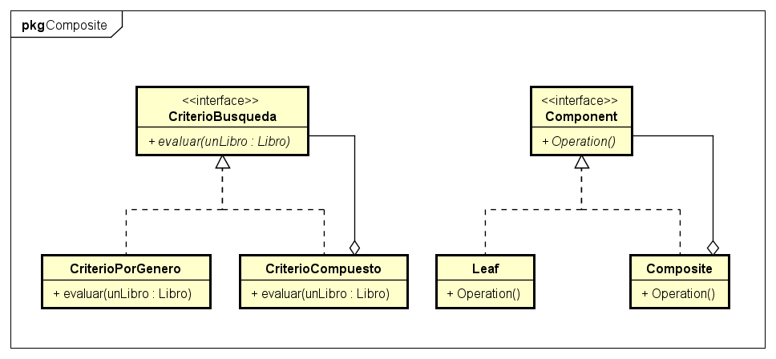

# Patrón Composite 
  
## Tipo : Object Structural

## Intención
Componer objetos en estructuras tipo árbol para representar una jerarquía.
Composite permite tratar a los objetos individuales o a la estructura de forma uniforme.

## Cuando usar
* Cuando se quiere representar una estructura de objetos.

* Cuando se quiere que el cliente ignore la diferencia entre una composicion de objetos y un objeto individual.
Se quiere que los maneje de forma uniforme.

## Consecuencias
* Los objetos individuales se pueden componer para formar estructuras mas complejas, que a su vez se pueden seguir componiendo.

* Hace que el uso desde el cliente sea mas simple, ya que el manejo es uniforme.

* Se vuelve fácil agregar nuevos tipos de componentes a la estructura.

* El diseño se vuelve muy general, lo cual puede complicar el restringir componentes de un composite. 
(Por ejemplo, tengo una estructura general, y quiero que solamente tenga ciertos tipos en específicos de objetos.)

## Otro ejemplo
 Se puede ver un ejemplo de uso en una aplicación [aqui](https://github.com/brunograssano/Algoritmos_3_TP2_PM2/tree/master/src/main/java/edu/fiuba/algo3/modelo/puntos "Link al TP2 de Algoritmos 3")
 (TP2 Algoritmos 3). En este caso este patrón se utilizó para representar al sistema de puntos del juego. Esto permitió simplificar su manejo a lo largo de toda la aplicacion.

## Diagrama
Se muestra un diagrama, a la izquierda esta el ejemplo realizado, y a la derecha el diagrama generico.

*No se incluyeron todas las clases que vendrian a ser Leaf en el diagrama del ejemplo*

* **Component** Declara las operaciones que podran realizar los objetos de la estructura

* **Leaf** Representa a los objetos que no tienen hijos en la composicion. Definen el comportamiento para las primitivas de *Component*

* **Composite** Define comportamiento para los objetos con hijos. Otras acciones que puede tener son el agregar, sacar, u obtener hijos.

El cliente manejaria la estructura a partir de la interfaz *Component*.

## Fuentes
* Libro Design Patterns: Elements of Reusable Object-Oriented Software – Gamma, Erich [pags 182-195]

* Material de clase, Algoritmos y programación III
