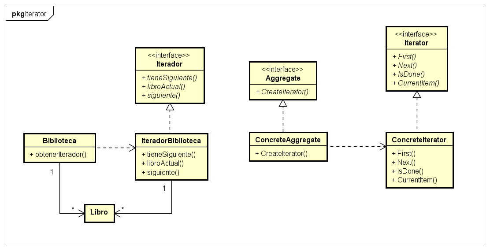

# Patrón Iterator
  
## Tipo : Object Behavioral

## Intención
Proveer de una forma de acceder a los elementos de un objeto secuencialmente sin
 exponer la estructura interna.

## Cuando usar
* Cuando se quiere acceder a los contenidos de un objeto sin exponer la estructura interna.

* Cuando se quiere permitir multiples recorridos.

* Cuando se quiere una interfaz comun para recorrer las diferentes estructuras. (Iteración polimorfica)

## Consecuencias

* Da soporte para implementar diferentes recorridos.

* Simplifica la interfaz del objeto que se recorre (Agreggate). 

* Se pueden realizar más de un recorrido sobre una misma estructura, ya que cada iterador mantiene su estado.

## Diagrama
Se muestra un diagrama, a la izquierda esta el ejemplo realizado, y a la derecha el diagrama generico.

* **Iterator** Define la interfaz para el acceso y recorrido de los elementos.

* **ConcreteIterator** Implementa la interfaz y mantiene la posición en el recorrido.

* **Aggregate** Define la interfaz para crear el objeto iterador.

* **ConcreteAggregate** Devuelve una instancia del iterador.

## Robustez del iterador
Si se modifica el aggregate mientras que sé esta recorriendo, se puede terminar accediendo a algún elemento más de una vez en caso de que no se copie
(generalmente es costoso).

Una solución a este problema es hacer que el aggregate mantenga sus iteradores, y que al momento de realizar un cambio los actualice.

## Fuente
Libro Design Patterns: Elements of Reusable Object-Oriented Software – Gamma, Erich [pags 271-288]
