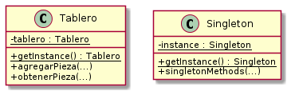

# Patrón Singleton 
  
## Tipo : Object Creational

## Intención
Asegurarse que una clase tenga solo una instancia, y que haya un solo punto de acceso a ella.

## Cuando usar
* Cuando se debe de tener una única instancia de una clase, y un unico punto de acceso.

## Consecuencias
* Se obtiene un gran control sobre el acceso a la instancia.

* Es una mejora respecto a variables globales.

* Permite variar el numero de instancias

* Rompe Single Responsibility, la clase se vuelve responsable de mantener y crear al objeto, haciendo que se tengan más motivos para cambiar.

* Hay que tener cuidado en aplicaciones concurrentes en el caso de lazy initialization (la instancia se crea en el primer llamado), ya que pueden ocurrir race conditions.

## Otro ejemplo
 Se puede ver un ejemplo de uso en una aplicación [aqui](https://github.com/brunograssano/Algoritmos_3_TP2_PM2/blob/af74dc91d24e97e612fe3dee16db1d5257636343/src/main/java/edu/fiuba/algo3/modelo/AlgoHoot.java "Link al archivo del TP2 de Algoritmos 3")
 (TP2 Algoritmos 3).
 
 Otro uso se puede ver [aqui](https://github.com/brunograssano/TP-taller-de-programacion-fiuba/tree/master/src/Server/modelo "TP de taller de programacion, parte del modelo") (TP de Taller de programación), en los archivos juego.hpp y juego.cpp. 
 También buscando se puede encontrar otro en la aplicación del lado del cliente.

## Diagrama
Se muestra un diagrama, a la izquierda esta el ejemplo realizado, y a la derecha el diagrama generico.

* **Singleton** Define una operación de acceso a la instancia.

## Fuente
Libro Design Patterns: Elements of Reusable Object-Oriented Software – Gamma, Erich [pags 150-157]
