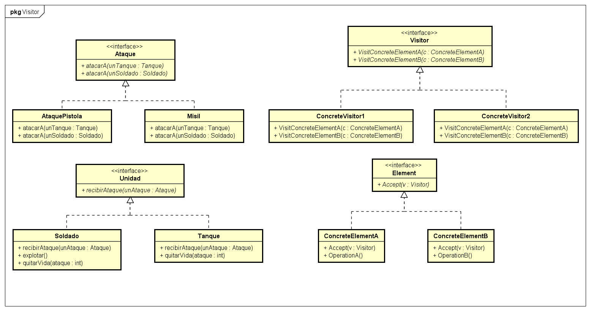

# Patrón Visitor  
  
## Tipo : Object Behavioral

## Intención
Representar una operación que se va a implementar en los elementos de una estructura.
Este patron permite definir nuevas operaciones sin cambiar las clases de los elementos en las que opera.

## Cuando usar
* Cuando una estructura contiene muchas clases de objetos con diferentes interfaces
y se quiere realizar operaciones en ellos dependiendo de sus clases concretas.

* Cuando se quieren realizar varias operaciones que son distintas, no tienen relación entre si
 y se quiere evitar contaminar las clases con estos métodos.

## Consecuencias
* Se vuelve más fácil agregar operaciones. 

* Se juntan las operaciones que tienen relación, y se separan las que no.

* Se vuelve difícil agregar nuevas clases que sean *ConcreteElement*. (Hace que se tenga que agregar al Visitor)

* Al momento de iterar, puede visitar objetos que no tengan un clase padre común. (Contrario al patron Iterator)

* Los *Visitors* pueden acumular estados que de otra forma se pasarían como argumentos.

* Puede romper encapsulamiento, ya que el patron hace que se agreguen operaciones que accedan al estado interno del objeto.

## Otro ejemplo
 Se puede ver un ejemplo de uso en una aplicación [aqui](https://github.com/brunograssano/Algoritmos_3_TP2_PM2/tree/master/src/main/java/edu/fiuba/algo3/modelo "Link al TP2 de Algoritmos 3")
 (TP2 Algoritmos 3).
 Se puede ver aplicado en el paquete *respuestas* y *preguntas*, para saber si una respuesta es valida para una determinada pregunta.
 En caso de serlo llama a la operación para que se evalúen las respuestas.

## Diagrama
Se muestra un diagrama, a la izquierda esta el ejemplo realizado, y a la derecha el diagrama generico.

* **Visitor** Declara las operaciones de visita por cada elemento concreto.

* **ConcreteVisitor** Implementan las operaciones de visita.

* **Element** Define la operación que recibe al Visitor.

* **ConcreteElement** Implementa la operacion que recibe al Visitor

## Fuente
Libro Design Patterns: Elements of Reusable Object-Oriented Software – Gamma, Erich [pags 340-353]
